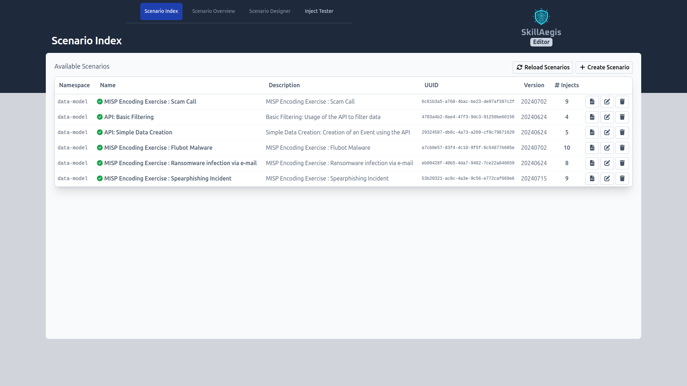
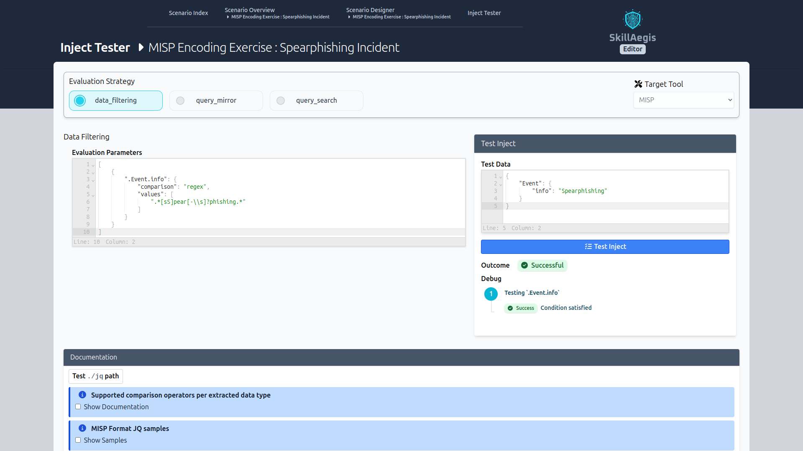

# SkillAegis-Editor
 

**SkillAegis-Editor** is a platform to design exercise scenarios, enhancing skills in applications like MISP and training users in best practices for information management and protective tools.

The Editor allows you to create scenarios under the [Common Exercise Format (CEXF)](https://misp.github.io/cexf/) that can be used by other application such as **[SkillAegis Dashboard](https://github.com/MISP/SkillAegis-Dashboard)**.

> [!NOTE]  
> Consider running this application with **[SkillAegis](https://github.com/MISP/SkillAegis)** for Production.



*List of all available scenarios*


*While designing a scenario, you can create multiple injects, specify their execution order, outline any requirements for each, and define the criteria for evaluating and marking them as complete.*


*Writing evaluations for injects can be challenging, so the inject tester is provided to streamline this process.*


## Installation

To get started with SkillAegis-Editor, follow these steps:

0. Ensure Python **3.10** or higher is installed.
    ```bash
    python -V
    ```
1. Install dependencies
   ```bash
   python3 -m venv venv
   source venv/bin/activate
   pip3 install -r requirements.txt
   ```
2. Clone the configuration file
    ```bash
    cp config.py.sample config.py
    ```
    - [optional] Update the configuration
3. Start the application
   ```bash
   # Usage: ./start.sh --exercise_folder <folder> [--host <host>] [--port <port>]
   ./start.sh --exercise_folder scenarios/
   ```

## Development

### Back-end
```bash
source venv/bin/activate
fastapi dev main.py
```

### Front-end

#### Project Setup

```sh
npm install
```

#### Compile and Hot-Reload for Development

```sh
npm run dev
```

#### Compile and Minify for Production

```sh
npm run build
```

#### Lint with [ESLint](https://eslint.org/)

```sh
npm run lint
```

# License
This software is licensed under GNU Affero General Public License version 3

```
Copyright (c) 2024 Sami Mokaddem
Copyright (c) 2024 CIRCL - Computer Incident Response Center Luxembourg
```
